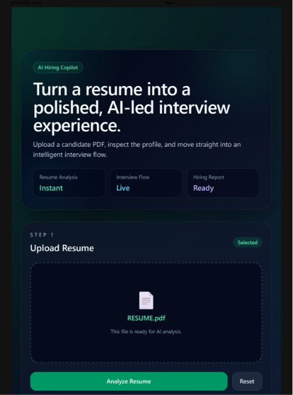
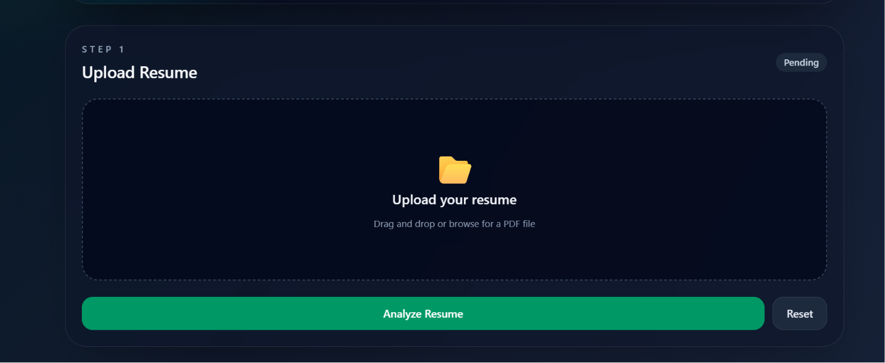
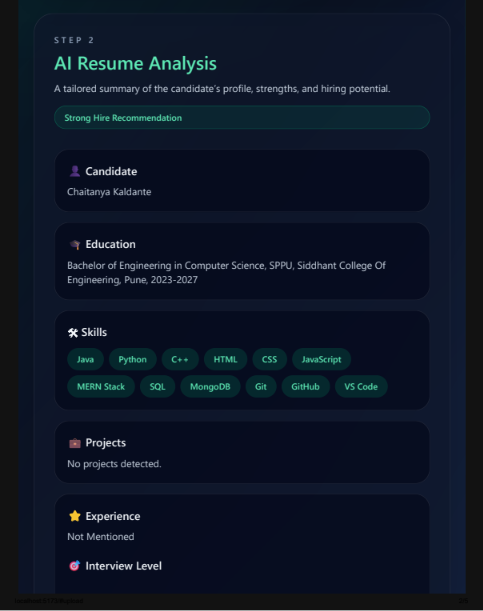
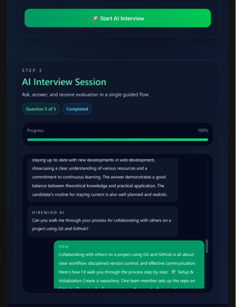
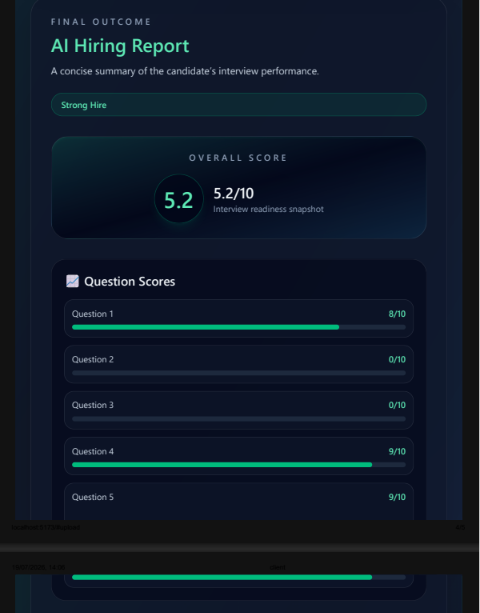

# 🚀 InterviewX-AI

> An AI-powered interview assistant that helps job seekers prepare smarter through resume analysis, personalized interview questions, and intelligent feedback.

## 🌟 Features

- 📄 AI Resume Analysis
- 🤖 Personalized Interview Question Generation
- 🎯 Skill Gap Identification
- 💡 Smart Feedback & Improvement Suggestions
- 🧠 AI-powered career guidance
- ⚡ Real-time interview preparation


## 🛠️ Tech Stack

### Frontend
- React.js
- HTML5
- CSS3
- JavaScript
- Bootstrap

### Backend
- Node.js
- Express.js

### Database
- MongoDB

### AI Integration
- OpenAI / Groq API


## 📂 Project Structure


🎯 How It Works

1.User uploads resume

2.AI analyzes skills and experience

3.System generates interview questions

4.User practices interview

5.AI provides improvement feedback


🚀 Future Improvements

1.Voice-based AI interviews

2.Video interview analysis

3.More AI career recommendations

4.User dashboard

5.Progress tracking


## ⚙️ Installation


Clone the repository:

```bash
git clone https://github.com/CK2740/InterviewX-AI.git

```

Go to frontend:

```bash
cd client
npm install
npm start

```

Go to backend:

```bash
cd server
npm install
npm start

```

# Screenshots

## Home Page



## Resume Upload



## AI Analysis



## Interview



## Report



